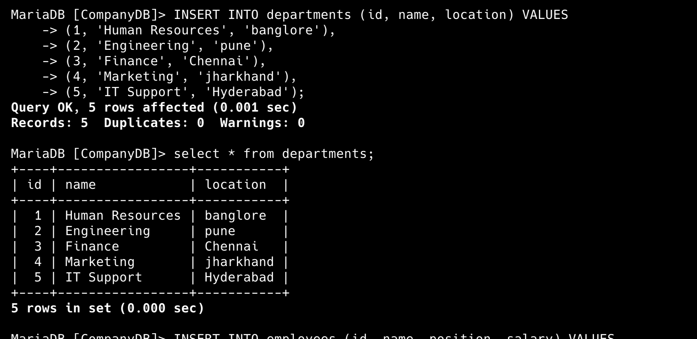
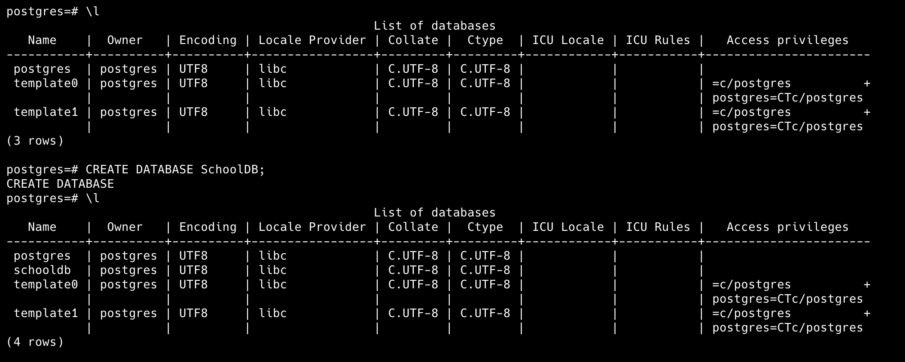
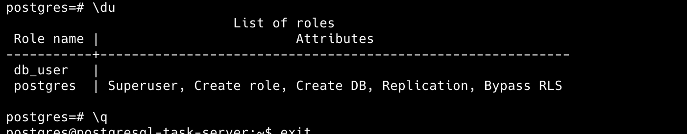

# Mysql/mariadb Assignment

## 1. Database Creation and Management

## 2.  Basic SQL Queries

## 3. Indexing and Performance

Creates an index named idx_name on the name column of the employees table.
This allows MySQL to look up names faster instead of scanning every row.

## 4. User and Permissions Management

## 5. Backup and Restore

# PostgreSQL Assignments:
## 1: Database and Table Creation

## 2. Basic SQL Queries
## 3. User and Permissions Management

## 4. Backup and Restore

## 5. Using pg_hba.conf for Authentication

--> the `pg_hba.conf` (PostgreSQL Host-Based Authentication) file is one of the most important security control files in PostgreSQL.
- It defines who can connect, from where, and how they authenticate

| Role                        | Description                                                                                                   |
| --------------------------- | ------------------------------------------------------------------------------------------------------------- |
| **Access Control**          | Specifies which users can access which databases.                                                             |
| **Connection Type Control** | Defines whether connections are local (socket) or remote (host, IP).                                          |
| **Authentication Method**   | Controls how users prove identity — options include `trust`, `md5`, `scram-sha-256`, `peer`, `password`, etc. |
| **Network Security**        | Can restrict access by IP range (e.g., `host all all 192.168.1.0/24 md5`).                                    |
| **Layer of Defense**        | Even if your DB port is open, unauthorized users can’t connect without being listed in this file.             |

--Mysql---
show databases;
create database CompanyDB;
show tables;
use CompanyDB;
create table employes ( id INT PRIMARY KEY, name VARCHAR(10), position VARCHAR(100), salary DECIMAL(10, 2));

select * from employes
rename table employes to employees;
INSERT INTO employees (id, name, position, salary) VALUES (1, 'Johny', 'HR Manager', 75000.00), (2, 'shika', 'Software Engineer', 95000.00), (3, 'Charlie ', 'Financial Analyst', 68000.00), (4, 'Athi', 'Marketing Specialist', 72000.00), (5, 'allari', 'IT Support Engineer', 65000.00);

select * from employees where salary > 50000;

update employees set salary=20000.00 where id=5;

SELECT * FROM employees WHERE id = 3;

DELETE FROM employees WHERE id = 5;

EXPLAIN SELECT * FROM employees WHERE salary > 50000;

CREATE INDEX idx_name ON employees(name);

DROP INDEX idx_name ON employees;

\s

\timing

CREATE USER 'db_user'@'localhost' IDENTIFIED BY 'Charan&99';
show grants for 'root'@'localhost';
GRANT ALL PRIVILEGES ON CompanyDB.* TO 'db_user'@'localhost';
SHOW GRANTS FOR 'db_user'@'localhost';
REVOKE ALL PRIVILEGES ON CompanyDB.* FROM 'db_user'@'localhost';
FLUSH PRIVILEGES;
SELECT User, Host FROM mysql.user;
DROP USER 'db_user'@'localhost';

mysqldump -u root -p CompanyDB > CompanyDB_backup.sql --> create backup

CREATE DATABASE CompanyDB_backup; --> to create new db
mysql -u root -p CompanyDB_backup < CompanyDB_backup.sql --> To restore data

---postgresql---
sudo -u postgres psql --> to get postgresql shell
\l --> to list databases in postgresql
\dt --> to list all tables
SELECT * FROM students;
 INSERT INTO courses (course_name, credits) VALUES
('Mathematics', 4),
('Physics', 3),
('Computer Science', 5),
('English Literature', 2),
('Biology', 4);

\c SchoolDB;

DROP USER db_user;

