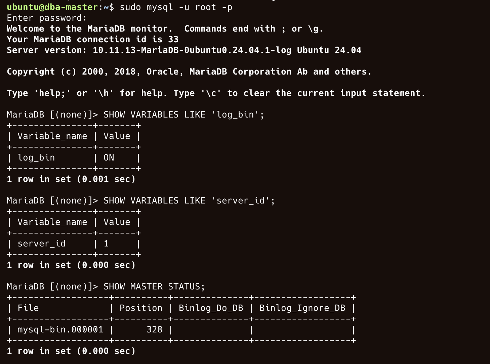
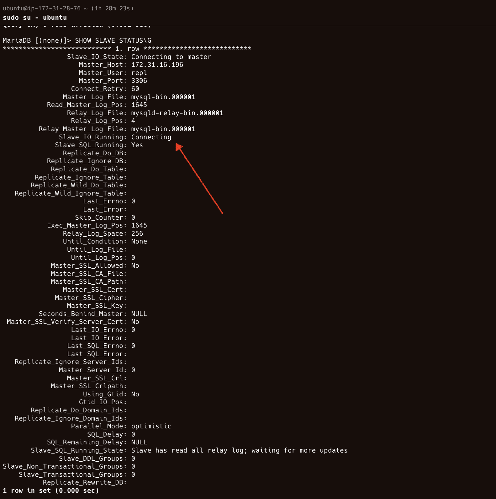

---------------

1. Preparation and assumptions
 - Master IP: xxx.168.xxx.10 (example)
 - Slave IP: xxx.168.xxx.11 (example)
 - MySQL/MariaDB installed on both (same major version preferred).
 - Root DB user password known.
 - Network: ensure TCP port 3306 is reachable from slave to master (firewall rules).

2. Master server configuration
 - Edit MySQL/MariaDB config (/etc/mysql/my.cnf or /etc/mysql/mysql.conf.d/mysqld.cnf or /etc/my.cnf depending on distro).

   > Add or update in [mysqld] section:
   > restart mysql
   > Create a replication user on the master:
   > Create a sample database and table with a few rows:
   > Take a consistent snapshot and record master binlog position

      Option A — using mysqldump (recommended for small DBs):

      From master shell (not inside mysql), run: 
    `sudo mysqldump -u root -p --single-transaction --master-data=2 --databases usersdb > usersdb_dump.sql`
    - --master-data=2 adds a commented CHANGE MASTER line with MASTER_LOG_FILE and MASTER_LOG_POS so you can find them in the dump.

    - --single-transaction ensures consistency for InnoDB.

     Open usersdb_dump.sql and find lines like:
   
     Alternatively, you can get master status:
        `SHOW MASTER STATUS;`
3. Copy snapshot to slave

 - Copy the dump file to the slave (or keep accessible):
    `scp usersdb_dump.sql user@192.168.100.11:/tmp/`

4. Slave server configuration
    1. Edit slave MySQL config (/etc/mysql/my.cnf):
```
    [mysqld]
server-id = 2
relay_log = /var/log/mysql/mysql-relay-bin
log_bin = /var/log/mysql/mysql-bin.log   # optional on slave but useful for chained slaves
read_only = 1
```
    2. Restart MySQL on slave:
```
sudo systemctl restart mysql
sudo systemctl status mysql
```
    3. Restore the dumped database on the slave:
        ssh to slave: `mysql -u root -p < /tmp/usersdb_dump.sql`
    4. Configure the slave to connect to the master.

You can either parse the MASTER_LOG_FILE and MASTER_LOG_POS from the dump or run SHOW MASTER STATUS; on master and use those values.

On slave, run in mysql prompt:

    5. Verify slave status:
        `SHOW SLAVE STATUS\G`

5. Verify replication with a test insert

On master:

USE usersdb;
    `INSERT INTO users (username, email) VALUES ('dave','dave@example.com');`


On slave, after a short moment:

USE usersdb;
   `SELECT * FROM users WHERE username='charan';`


1. Created two ec2 instances in aws. 

 primary host
 slave host





slave-setup
------------





--> due to same server-id in configuration of slave and master


