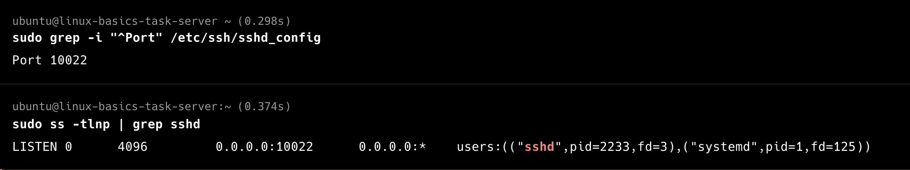

## 1. Disabling IPV6

#### IPV6 Disablement using 2 methods
  **sysctl**

  **grub**
Before edit

After edit

all commands

after reboot

#### Difference between Disabling IPV6 via sysctl and GRUB
|Aspect | Sysctl | GRUB |
|---|---|---|
|scope| Runtime Configuration, influencing areas like networking, memory management, and security settings.|Kernel-level configuration(boot time) |
|purpose|Manages and modifies kernel parameters at runtime|Bootloader; loads the kernel and passes initial parameters.|
|effect|Disables IPv6 after kernel loads|Prevents kernel from even initializing IPv6|
|reliability|Sometimes partial — apps might still see IPv6 module|Fully disables IPv6 stack from boot|
|persistence|Needs config file to persist|Always persistent after GRUB update|
|modules loaded|Pv6 module may still be loaded (just unused)|IPV6 modules never loaded|
|when applied|After system boots|During system boot|

#### Why One Might Be Preferred Over the Other
Use sysctl when:

- You want to disable IPv6 temporarily or for testing.

- You still might re-enable it later.

- You don’t want to reboot the system.

Use GRUB when:

- You want to completely and permanently disable IPv6 at kernel level.

- Security compliance requires no IPv6 kernel module loaded.

- You’re troubleshooting kernel-level networking behavior or want to save boot time/memory by not loading IPv6.

|Purpose|Recommended Method|
|---|---|
|Test/Temporary Disable|sysctl|
|Permanent, systemwide disable|grub|
|compliance/securityhardening|grub|
|quick change without reboot|sysctl|

## 2. firewall configuration

## 3. selinux status

- Ubuntu does not use SELinux by default.
It uses AppArmor as its mandatory access control (MAC) system instead

## 4. SSH Port configuration

## 5. Firewall Rules Verification

| **Feature**                      | **Normal Rules**                 | **Rich Rules**                               |
| -------------------------------- | -------------------------------- | -------------------------------------------- |
| **Syntax**                       | Simple (service/port based)      | Flexible (XML-style rule format)             |
| **Granularity**                  | Basic                            | Fine-grained (IP, interface, protocol, etc.) |
| **Ease of Use**                  | Very easy                        | Requires understanding of syntax             |
| **Source/Destination Filtering** | Not supported                    | Fully supported                              |
| **Logging**                      | Not supported                    | Supported                                    |
| **Actions (accept/reject/drop)** | Implicit                         | Explicit and configurable                    |
| **Best For**                     | Standard firewall configurations | Advanced or custom security policies         |
|ex: sudo firewall-cmd --permanent --add-service=http
sudo firewall-cmd --permanent --add-port=8080/tcp | ex: sudo firewall-cmd --permanent --add-rich-rule='rule family="ipv4" source address="203.0.113.5" port port="22" protocol="tcp" accept'
|

Normal rules → Simple “allow or deny” by service or port.

Rich rules → Advanced control, ideal for specific source IPs, logging, and complex conditions.

**some of the specific scenarios where richrules are beneficial than normal rules**
| **Scenario**                                                                     | **Why Use Rich Rule**                                               |
| -------------------------------------------------------------------------------- | ------------------------------------------------------------------- |
| You need to **block or allow specific IP ranges**                                | Normal rules can’t filter by source/destination.                    |
| You want to **log** suspicious traffic                                           | Only rich rules support logging actions.                            |
| You want to **allow a service for one subnet but deny it for others**            | Rich rules can combine service and source filtering.                |
| You want to **reject packets with an ICMP message** instead of silently dropping | Rich rules allow action customization (`reject`, `drop`, `accept`). |
| You want **interface-specific rules**                                            | Rich rules can specify interfaces directly.                         |

